# msdelta — experiment log

A running record of what we built, what we tried, what broke, and how we know.
Read top-to-bottom — the iteration history is chronological.

---

## 0. Project goal

Train a transformer encoder over peak-tokens with a **learned per-head Δm/z
attention bias**, and verify that heads specialize on chemically meaningful
Δm patterns (isotopes, amino-acid residues, neutral losses) when pretrained
on consensus MS/MS spectra. Everything in this log is in service of getting
to a point where we can read off chemistry from the bias-curve plots.

The plot we want to look at, per head, is `bias_h(Δm)` evaluated on a dense
Δm grid:

- **Fine range** `Δm ∈ [-5, 5] Da` step 1 mDa — for isotopes and small mods.
- **Coarse range** `Δm ∈ [-200, 200] Da` step 10 mDa — for residues and losses.

Reference Δm values overlaid: ±1.003 (¹³C), 17.027 (NH₃), 18.011 (H₂O),
27.995 (CO), 43.990 (CO₂), 57.021 (G) … 186.079 (W), 162.053 (hexose), …

---

## 1. Architecture (current)

Source of truth: `msdelta/`. Key components:

- **`fourier.py`** — log-spaced sin/cos features, clamp-guarded.
- **`data.py`** — parquet streaming dataset, per-spectrum preprocessing
  (intensity-floor + top-N + log1p+norm), **denoising collate** (Gaussian
  m/z noise).
- **`model.py`** — `PeakEmbed` (Fourier(m/z) ⊕ Fourier(log_int) → MLP →
  d_model), `DeltaMZBias` (per-head independent MLPs from `Fourier(Δm)`),
  `BiasedMHA` (custom multi-head attention that adds per-head bias to
  logits), `EncoderBlock` (pre-norm), `MSEncoder` (shared bias across
  layers), `DenoiseHead` (per-peak residual + log_var, Gaussian NLL on
  the cleaning residual).
- **`train.py`** — AdamW + warmup→cosine, bf16 autocast, wandb,
  periodic bias-curve PNGs.
- **`viz.py`** — bias-curve plotting with chemistry reference lines.

Current pretraining task: **m/z denoising autoencoder** with Gaussian σ =
0.3 Da. Predict the clean m/z given the noisy m/z + clean intensities.

---

## 2. Data infrastructure

### What broke: MSZX dataloader memory explosion

The original plan used the mscompress MSZX dataloader pointed at
`/mnt/vault-1/k8/concensus_spec_30M/consensus_100M/mszx/` (~100M consensus
spectra in 90 .mszx shards).

**Symptom:** memory ballooned to ~500 GB during a real run (8 workers ×
~60 GB/worker). One bug we fixed cheaply, two we didn't:

1. *Fixed:* `worker_init_fn` was re-opening all 88 shards in every worker
   instead of inheriting via fork. Removed.
2. *Fixed:* `__init__` was eagerly opening all 88 shards. Now reads only
   the manifest.json from each tar for length info.
3. *Couldn't fix from msdelta-side:* mscompress's C decoders allocate
   per-process state that grows with the number of distinct shards
   touched. At RandomSampler scale, every worker eventually touches
   every shard.

**Decision:** switched to the parquet files in the parent directory.

### Switch to Parquet `IterableDataset`

`ConsensusParquet(IterableDataset)` streams `(file, row_group)` units —
one ~263 MB row-group held in arrow per worker, shuffled within and
across. No random per-spectrum lookups across all shards.

**Memory after switch (50 batches, batch_size=64):**

| num_workers | system Δ |
|---|---|
| 0 | 1.14 GB |
| 2 | 2.14 GB |
| 4 | 4.41 GB |
| 8 | **9.58 GB** |

~12× reduction vs MSZX, bounded by row-group footprint. Investigation
of the MSZX leak is parked.

---

## 3. Task iterations — what didn't work

This is the heart of the log. Each version solved the previous failure
and exposed a new one.

### v1 — MPM with m/z zeroed at masked positions

**The task.** Mask 15 % of peaks. For masked peaks, set `m/z = 0` and
`log_int = 0` in the input; swap the embedding for a learned `[MASK]`
token; predict the original `m/z` (Gaussian NLL) and `log_int` (MSE).

**Observation at step 10k.** A large *positive* spike at Δm = 0 on every
head, and nothing else.

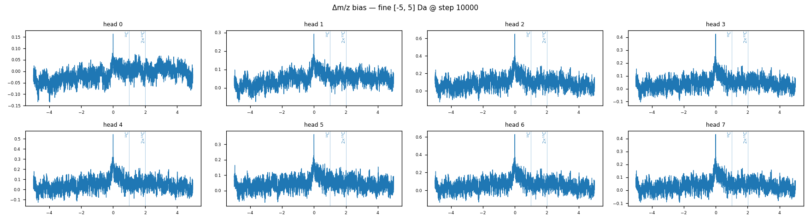
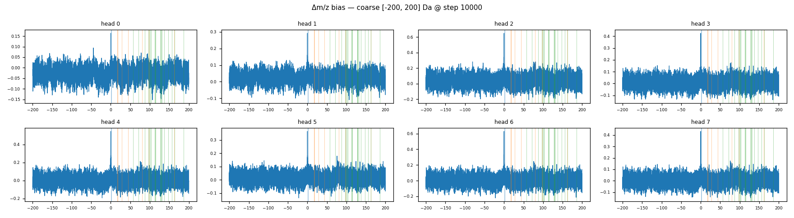

**Root cause.** Zeroing the m/z at masked positions doesn't just hide it
from the embedding — the Δm-bias module sees the same zeros and computes
fake `Δm = 0 − 0 = 0` pairs for every pair of masked positions, every
pair of padded positions, and every masked-padded pair:

| pair type | Δm computed | count per spectrum (K=150, ~22 masked) |
|---|---|---|
| diagonal `(i, i)` | `m_i − m_i = 0` | 150 |
| masked × masked (off-diag) | `0 − 0 = 0` | 22 × 21 ≈ 462 |
| padded × padded, padded × masked | `0 − 0 = 0` | depends on batch |
| real × real | actual Δm | the rest |

The bias module learned `bias(0) ≫ 0` because it's a free, perfectly
reliable signal for "these two are both mask tokens, lump them
together" — pure bookkeeping, no chemistry.

### v2 — keep real m/z at masked positions; zero the bias for masked-touching pairs

**The fix.** Stop zeroing `m/z` in the collate (keep real values, the
`[MASK]` embedding swap still prevents direct leakage via the token).
In `MSEncoder.forward`, multiply the bias by a mask that's zero on any
pair where either endpoint is masked or padded. Together these:

- Remove the fake `Δm=0` cluster from the bias path.
- Prevent the masked m/z from leaking back through `m_masked = m_key +
  Δm` (a real concern: if a head learns spike at Δm = +113, the model
  could recover masked m/z from key m/z).

**Observation at step 22k.** The positive spike is gone — replaced by
a *negative* dip centered at Δm=0, ~3 Da wide, on every head, growing
deeper as training proceeds.

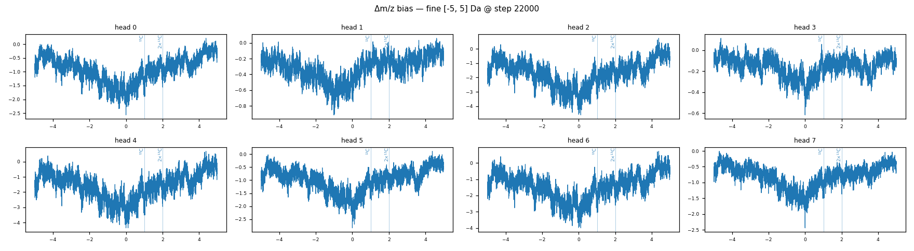
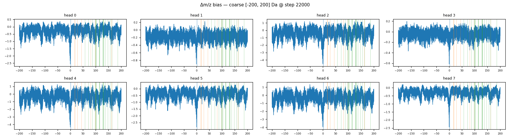

**Diagnosis.** The bias module discovered that **self-attention is
near-useless for MPM** (the `[MASK]` token has no info on its own; it
must look at neighbors). The bias path is a much cheaper lever for
expressing "don't attend to yourself" than tuning Q/K to make `q_i · k_i`
small. So the model poured most of its bias gradient into a single
broad bump at Δm=0 — global self-attention suppression, no chemistry.

The dip was *growing*, not shrinking, over training: −0.4 at step 4k →
−4 at step 22k. At −4 a softmax logit reduces attention mass by exp(−4)
≈ 50×.

### v3 — also zero the diagonal of the bias

**The fix.** In addition to v2, set `bias[:, :, i, i] = 0`. Now the
bias module *cannot* modulate self-attention at all. The model must
suppress self-attention through Q/K content — slower to learn, but the
right place for that decision to live.

**Observation at step 50k.** The dip got smoother and wider, but didn't
go away. 7 of 8 heads still showed the same shape.

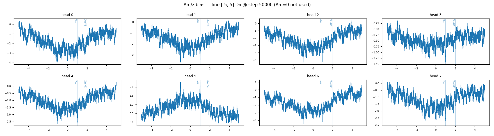
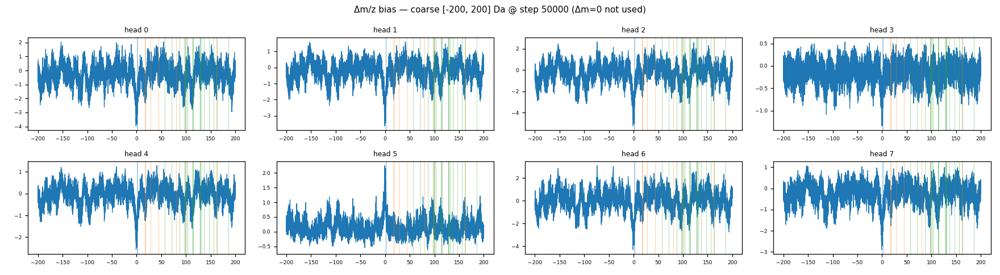

**Diagnosis.** Sampling the actual data revealed that ~14 % of all
consecutive-peak Δm pairs in real spectra are < 0.5 Da. The dataset
itself contains a *flood* of near-zero non-diagonal pairs (near-duplicate
peaks, charge variants, ions with tiny m/z differences). The model
correctly learns that these pairs are uninformative for MPM and
suppresses them. Removing the diagonal entry alone doesn't help —
the surrounding off-diagonal small-Δm pairs carry the same signal.

The bias module's capacity was being soaked up by this high-volume
"deduplicate small Δm" task. Of 8 heads, one (head 5) happened to
specialize on the ¹³C isotope spike — random init lottery.

### v4 — independent per-head bias MLPs

**The fix.** Replaced the shared `Linear → GELU → Linear` MLP with **8
independent per-head MLPs** (stacked as `(H, in_dim, hidden)` Parameter
tensors, applied with einsum for batched compute). Decoupling the
gradient pools so each head can drift into its own basin instead of all
8 competing for the same hidden representations.

`DeltaBiasConfig.hidden` → `per_head_hidden`, default 32 (to keep
activation memory bounded; the activation cost is `(B, K, K, H *
per_head_hidden)` which is ~6 GB at production scale).

**Observation at step 48k.** Bias curves DID become more diverse than
v3 — heads no longer all converged to the same shape. But still no
clean chemistry, and the ±1.003 spike that head 5 had in v3 was *gone*.

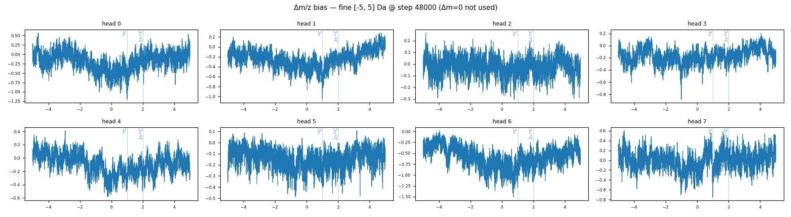
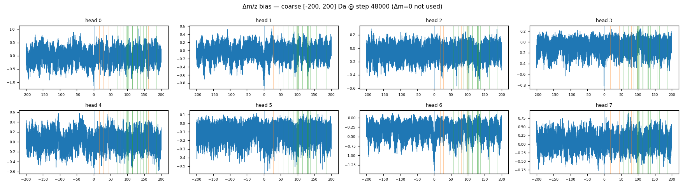

**Then I checked the actual prediction quality.** This is where the
real problem surfaced:

```
val/nll_mz       = 7.06         ← "looks like it's learning" (was 13.3 at step 0)
mean_log_var     = +10.00       ← clamped at the upper bound, for 100% of predictions
val/mse_int      = 0.006        ← intensity head, basically untrained

Inferred over 45,804 val targets:
   model RMS m/z error    = 307.0 Da
   predict-spectrum-mean  = 307.2 Da   ← identical to the no-model baseline
   prediction range       = 260 — 1020 Da (target range 56 — 2180 Da)
   prediction std         = 129 Da     (target std 332 Da)

grad_norm_delta_bias / grad_norm_total = 0.007 / 0.486 = 1.4 %
```

**Root cause: the MPM task is fundamentally ambiguous in our setup.**
All 22 masked positions in a spectrum get the same `[MASK]` embedding,
the bias is suppressed for masked queries (so no Δm-derived position
hint), and there's no positional encoding (peaks are a set). From the
model's perspective, every masked query is *literally identical*: "I'm
some peak in this spectrum, predict my m/z." The loss-minimizing answer
is: predict the spectrum's mean, crank the variance up to absorb the
error. That's what it found.

The bias module gets ~no useful gradient (1.4 % of total) because the
task doesn't reward chemistry. The "more diverse heads" in v4 were just
heads drifting under noise pressure, not specializing.

**Conclusion: the v3 fixes were all correct in isolation, but they were
treating symptoms of a deeper problem — the wrong task.**

### v5 — m/z denoising autoencoder

**The fix.** Switch the objective:

- **Don't mask.** Every peak's identity (its m/z) is preserved.
- **Add Gaussian noise** (σ = 0.3 Da) to every peak's m/z.
- **Predict the clean m/z** per peak — head outputs `(residual, log_var)`,
  predicted clean = `noisy + residual`, loss = Gaussian NLL on the
  residual against the true delta.

Why this works in principle:

- Every peak has a unique identifier (its noisy m/z). Task is
  well-defined per position.
- Knowing neighbors' m/z values and the typical Δm structure (isotopes,
  residues) *directly helps* denoising — that's the model's lever.
- The bias path is no longer suppressed for predicted positions, so it
  can carry chemistry signal.

The collate is `DenoiseConfig(gauss_sigma=0.3)` and the head is
`DenoiseHead`. Initial smoke test on a tiny model:

```
init RMSE (= noise σ)   = 0.31 Da
after 100 toy steps     = 0.38 → 0.41  (toy is too small to show real denoising)
```

**Deliberate non-choice.** I almost added a 15% chance of ±1.003 Da
"isotope swap" to the noise model. We discussed and dropped it: it would
have *pre-loaded* the answer for ¹³C and made any ±1.003 spike in the
bias plots uninterpretable as discovery. The cleanest experiment is
Gaussian-only — *anything* the bias module learns is then attributable
to real chemistry in the spectra, not to an injected signal.

**Observation at step 6k (first real run).** The denoising *works* and
the bias module is *finally getting gradient* — but a new failure mode
appeared:

```
step    rmse    nll      |g_total|   |g_bias|
0       0.299   -0.67     2.3         0.000
1500    0.275   -1.00     1.5         0.007
3000    0.267   -1.11     5.1         0.059
4500    0.260   -1.17     5.6         0.047
6000    0.247   -1.34    16.7         0.069
6750    0.246   -1.29    61.7         0.234   ← total grad norm exploding
```

- RMSE 0.30 → 0.245 — real denoising, but modest.
- `|g_bias|` 0.004 → 0.234 — **the bias module is being actively shaped now**
  (vs 1.4 % vestigial in MPM). The per-head MLPs + well-defined task worked.
- `|g_total|` spiking to 60+ — training landscape gone pathological
  (saved only by `grad_clip=1.0`).

The bias curves show a **giant positive bump at small Δm**, +6 logits on
heads 0/1/2 (`exp(6) ≈ 400×` attention):

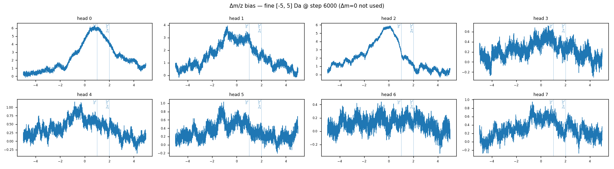

**Diagnosis: "bias dominates content" — item 4 in the high-level plan's
failure-mode list (§6.3),** which says verbatim: *"all attention goes to
nearest-mass peaks regardless of intensity. Add a scale factor on the
bias output or layer-norm it."*

Why the sign flipped vs MPM (dip → bump): denoising rewards *using*
nearby peaks, so the bias gets positive gradient at small Δm. With no
ceiling there's a positive feedback loop (stronger local bias → more
peaked attention → lower loss → stronger bias) → runaway.

The subtle part: peaks are noised **independently**, so a generic
"attend to whatever's nearby" strategy *can't* actually denoise well —
which is why RMSE stalled at 0.245. The strategy that *would* work is
chemistry-specific (anchor to your ¹³C partner at +1.003, your residue
neighbors at exact masses). The broad bump is a suboptimal local minimum
the unbounded bias let the model over-commit to.

### v6 — bound the bias magnitude (tanh)

**The fix.** Cap the per-head bias to ±`scale` logits in `DeltaMZBias`:

```python
bias = scale * tanh(raw / scale)        # scale = 3.0, fixed (config: delta_bias.scale)
```

±3 logits is comparable to the content term's natural scale
(`q·k/√d ~ O(1–2)`), so neither can steamroll the other. Rationale:
(1) stop the runaway / gradient explosion, and (2) by capping the cheap
broad-bump strategy, create pressure to find the sharper,
chemistry-specific features that actually lower the loss further.

**Observation (full 50k run, σ still 0.3).** The bound worked
mechanically and the run is the best so far — but the chemistry result
is *blurry, not clean*.

```
val/rmse_mz : 0.30 → 0.22   (v5 stalled at 0.245 — bound let it push further)
bias range  : capped at ±3  (no more +6 runaway)
|g_total|   : spiked to 25–32 mid-training (v5 was 60; halved, not fixed)
|g_bias|    : 0.05–0.2, stable, non-vestigial — bias module is being shaped
```

Coarse curves show sharp peaks above a bounded baseline; fine curves
show a broad bump centered near 0:

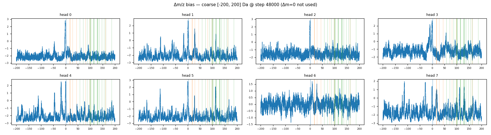
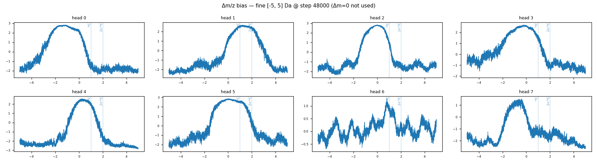

**Quantitative alignment check (plan §6.2b), NOT eyeballing.** With 27
reference Δm values in [2, 200] Da and tolerance 0.15 Da (chance hit-rate
3.9%):

| | strong peaks | aligned <0.15 Da |
|---|---|---|
| all 8 heads | 80 | **2 (0.6× chance — below random)** |

The strong peaks are *real* (heights 1–1.6, well above noise) and
**clustered in the chemically active 17–160 Da band**, but they sit
**0.2–0.8 Da off** the actual masses:

| head | top peak | nearest ref | offset |
|---|---|---|---|
| 1 | 28.14 | CO 27.995 | 0.15 ✓ |
| 1 | 113.81 | N 114.04 | 0.23 ~ |
| 7 | 129.58 | E 129.04 | 0.54 ✗ |
| 7 | 111.35 | L/I 113.08 | 1.7 ✗ |
| 3 | 56.23 | G 57.02 | 0.79 ✗ |

So: *chemistry-adjacent structure in roughly the right region, but not
locked to specific masses.* Not clean discovery.

**Root cause — the noise scale, tying fine and coarse together.**
`σ = 0.3 Da` on m/z → `σ√2 ≈ 0.42 Da` on Δm. Every Δm relationship is
pre-blurred by ±0.42 Da:

- **Residues (57–186 Da):** 0.42 blur is small vs the spacing → peak
  survives but broadens and its center drifts a few tenths of a Da
  (the shifted coarse peaks).
- **Isotopes (1.003 Da):** 0.42 blur is *huge* vs 1.003 → a true ¹³C
  pair smears across `1.003 ± 0.85`, i.e. into the broad ±2 Da bump
  that dominates the fine plot. The isotope signal is present but
  unresolvable.

The fine bump and the coarse drift are the **same blur at two scales**.

**Grad spikes are a separate issue: Gaussian-NLL overconfidence.** Not
the bias (`|g_bias|` is small). The head predicts heteroscedastic
variance (val NLL −1.67 < the −1.0 a fixed-variance Gaussian gives at
RMSE 0.22), so a tiny predicted `log_var` on a hard peak makes
`err²/exp(log_var)` and its gradient blow up. `grad_clip=1.0` caught it.

### v7 — drop noise to σ = 0.1

**The change.** `data.denoise.gauss_sigma: 0.3 → 0.1` (Δm blur drops
from 0.42 to ~0.14 Da). Single highest-value lever: sharpen coarse peaks
onto true masses and shrink the isotope blur so the ±1.003 spike can
resolve. Changed *only* σ to isolate the effect.

**Result (full 50k run).** Denoising got much better; chemistry got
*closer but not convincing*.

```
val/rmse_mz : 0.10 floor → 0.035   (v6 was 0.22 off a 0.30 floor — 59% vs 27% of noise removed)
probe       : Spearman(bias, attention) 0.69–0.98 across heads/ranges → bias LOAD-BEARING
alignment   : FINE  best head6 1.7×, p=0.26  (isotopes still at chance)
              COARSE best head3 2.0×, p=0.064 (closest yet, but NOT significant)
```

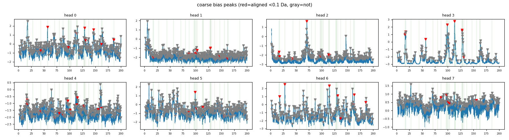
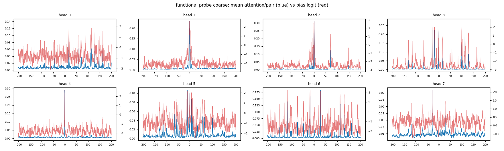

Trend of best coarse p-value across runs: **0.15 (v6) → 0.08 (v7@15k) →
0.031 (v7@35k) → 0.064 (v7 final).** It crossed 0.05 mid-run then drifted
back as the cosine LR decayed to ~0 — i.e. it's hovering at the threshold,
not locking in. With 16 comparisons (8 heads × 2 ranges) the null expects
~0.8 false positives, so one head at p≈0.05 is **not** robust evidence.
Honest verdict: **no convincing chemistry discovery.**

**The structural signal that matters most.** Head 3 — the only head
approaching alignment — has **138 peaks vs 300–400 for the others**. It's
the one head that went *sparse* instead of staying a noisy thicket, and
that sparsity is exactly what let its peaks (L/I 113, V 99, K 128, H₂O 18)
land on real masses. The noisy heads can't align because they have a peak
near everything. This is the empirical motivation for v8.

The fine/isotope range still shows the broad locality bump — even at
σ=0.1's 0.14 Da resolution, the model isn't making a sharp ±1.003 spike,
because the broad "attend within ±1–2 Da" bump already captures the
isotope partner. No pressure to be precise.

### v8 — L1 sparsity penalty on the bias *(implemented; not yet run)*

**The hypothesis, from head 3.** Chemistry emerges when a head goes
sparse. Head 3 did it by accident; force *all* heads sparse and more
should lock onto chemistry. Add `λ · mean|bias_h(Δm)|` (evaluated on a
uniform Δm grid) to the loss. L1 (not L2) because its constant gradient
drives small values to *exactly zero* → a few tall spikes survive, the
broad bump and noise floor get pruned.

This is a **fork test, not a tuning exercise** (coarse 3-point λ probe,
everything else frozen):
- bias sharpens **and** RMSE holds ≈0.035 → chemistry-denoising viable,
  lock in denoise+L1, *then* tune.
- bias sharpens **but** RMSE craters → locality was load-bearing, the
  task is wrong → pivot to a discriminative task (ELECTRA-style).

`l1_lambda: 0.0` reproduces v7 exactly.

**Result (3 runs, 20k steps each: λ = 0.01, 0.1, 1.0).** Neither fork
branch — a *third* outcome we hadn't written down.

| run | mean\|bias\| | RMSE | head outcome | best align p |
|---|---|---|---|---|
| v7 (λ=0) | 1.56 | ~0.039 | 8 noisy heads (~40 pk ea) | 0.064 |
| λ=0.01 | 0.55 | 0.043 | shrunk uniformly, still noisy | n.s. |
| λ=0.1 | 0.035 | 0.047 | **7/8 heads zeroed; 1 survivor still a thicket** | n.s. |
| λ=1.0 | 0.00 | 0.048 | all heads dead (content-only) | n.s. |

The L1 worked mechanically (bias magnitude collapsed with λ) but produced
**head-death, not head-sharpening** — the optimizer zeroed whole heads
rather than concentrating each onto a few chemistry spikes. No setting
produced significant chemistry.

**The decisive insight — an ablation hiding in the sweep.** λ=1.0 is a
clean ablation: bias ≡ 0, pure content attention. Its RMSE (0.048) is only
~0.005 Da (~11%) worse than the near-full-bias λ=0.01 run (0.043). So:

> **The Δm bias is *used* (probe: attention follows it) but nearly
> *dispensable* (ablation: removing it costs ~11% RMSE). Content attention
> reproduces ~90% of what it does.**

That reconciles "load-bearing" (probe) with "head-death under L1": since
the bias barely helps denoising, the optimizer happily sacrifices 7 heads
to satisfy the penalty. There is no gradient pressure to encode chemistry
because **the denoising task can be solved by content attention alone** —
it never *needs* Δm-relational reasoning.

**Verdict — the real fork was a third branch:** *the bias is optional for
this task; no regularizer can force chemistry into a parameter the
objective doesn't require.* Four interventions (per-head MLPs v4, bounded
bias v6, smaller noise v7, sparsity v8) all leave the bias chemistry-free.
v7's head 3 (p=0.064) was a lucky fluctuation, not an amplifiable signal.
→ **Pivot to a task where Δm-relational reasoning is irreducibly necessary
(can't be done peak-by-peak). See v9.**

### Interlude — the probe suite (plan §6.1) flips the narrative

Before pivoting we built `msdelta-probe` (frozen-encoder linear probes) and
ran it on v7's checkpoint. The result reframes everything:

| tier | probe | result | baseline |
|---|---|---|---|
| 1 | precursor m/z | MAE 7.9 Da, R²=0.997 | 520 Da |
| 1 | peak count | R²=0.994 | — |
| 1 | log TIC | R²=0.989 | — |
| 2 | **charge** | **acc 100%** | 59% |
| 2 | **neutral loss** | **AUC 0.96** | 0.49 |
| 2 | **isotope M+k** | **F1 0.86** | — |

**The encoder learned the chemistry — extremely well.** Charge is read
straight from isotope spacing (1/z Da); the encoder gets it 100%. So the
chemistry is *present* — it just lives in the **content path** (Q/K/V over
m/z-bearing tokens), not in the Δm bias. The bias-curve analyses weren't
wrong; the chemistry simply isn't where we were looking.

Root cause, made precise: **tokens carry m/z** (`PeakEmbed` =
`MLP([Fourier(m/z) ⊕ Fourier(int)])`), so `q_i·k_j` can compute any
function of `(m/z_i, m/z_j)`. Content attention is a complete substitute
for a Δm bias — so the bias is never forced to carry chemistry. This is
the "absolute position baked into tokens" regime; relative-position
biases (ALiBi/T5) only become load-bearing when absolute position is
*stripped from the tokens*.

### v9 — m/z-free tokens + masked-intensity prediction *(this branch)*

The T5 mapping for a spectrum: **m/z = position**, **intensity = content**.
T5 strips position from tokens (relative bias carries it) and predicts
*content*. Our v5–v7 denoising predicted m/z = *position* — the one thing
you can't predict once you strip it. The faithful analog predicts
intensity instead:

- **`PeakEmbed` becomes m/z-free:** token = `MLP(Fourier(log_int))` + a
  learned `[MASK]`. Tokens no longer know their own m/z.
- **m/z flows only through `DeltaMZBias`** → the bias is now the *sole*
  carrier of all m/z structure. Forced load-bearing, ALiBi-style.
- **Task = masked-intensity prediction:** mask ~15% of peaks' intensity
  (token → `[MASK]`), predict it. Loss = **MSE on masked positions only**:
  `L = mean_{(b,i)∈mask} (pred_i − logint_i)²`.
- No leak: a masked peak is handed its *position* (m/z, via the bias) and
  asked for *content* (intensity) — never the reverse. Its identity is
  purely relational, exactly the T5 sentinel.

**Why this forces chemistry into the bias.** To predict a masked peak's
intensity the cleanest move is to find its M+0 partner at −1.003 Da and
scale by the isotope ratio — which the model can *only* do by reading a
¹³C feature off the bias (tokens have no m/z). Minimizing this MSE
directly rewards a +1.003 bias spike. The incentive is in the objective,
not hoped for.

**Why MSE not Gaussian-NLL:** intensity is bounded in (0,1]; the NLL
variance head caused the v5–v7 grad-norm explosions. Point estimate is
safer for the fork test.

**The gate (don't repeat the v8 mistake):** before a full run, train this
**with the bias ablated** (content-only). With m/z-free tokens, content
attention has no m/z at all — if content-only *still* solves masked-
intensity, the task doesn't need the bias and we rethink. If content-only
fails and the full model succeeds, the bias is doing the work.

**Risk:** a single scalar/peak is thin signal; intensity may lean on
absolute m/z (now unavailable) more than relational structure, making the
task too hard. The ablation gate + probe suite tell us before we commit.

**Scoreboard:** rerun `msdelta-probe` on the v9 checkpoint. The question
is whether charge/isotope/neutral-loss *still* decode well now that the
bias is forced to carry m/z — and whether the bias curves finally show
significant alignment (`msdelta-analyze`).

**RESULT (full 50k run, `runs/20260524-140946`) — the pivot worked.**
First positive result of the project.

*Transfer (probe suite) — chemistry fully decodable, now necessarily via
the bias:*

| probe | v9 (m/z-free) | note |
|---|---|---|
| precursor m/z | R² 0.996 | reconstructed with **no m/z in tokens** |
| charge | **100%** | charge = isotope spacing → only reachable via the bias |
| neutral loss | AUC 0.95 | |
| isotope M+k | F1 0.87 | |

charge=100% + precursor R²=0.996 with m/z-free tokens proves the Δm bias
is carrying the m/z chemistry — the load-bearing property v4–v8 never had.

*Bias-curve alignment (`msdelta-analyze`) — first significant chemistry head:*

| | enrichment | p | top hits |
|---|---|---|---|
| **coarse head 4** | **2.2×** | **0.002** | M·131, V·99, E·129, L/I·113 (<0.1 Da) |
| **fine head 4** | **2.5×** | **0.011** | ¹³C/z3·0.334, ¹³C/z2·0.501, ¹³C·1.003 |

Head 4 is significant in **both** ranges. Coarse **survives
multiple-comparison correction** (16 tests × 0.002 ≈ 0.032 < 0.05) — vs
v7's best non-surviving p=0.064.

**Measurement fix (charge-aware isotopes).** Initially fine-isotope
alignment looked merely near-significant (p=0.06) — because we scored
only the z=1 spacings {1.003, 2.005}. But ¹³C spacing in *m/z* is
`1.003/z`, and the data is mostly z=2/3, so the real isotope peaks sit at
**0.502 (z=2)** and **0.334 (z=3)** — which the model learned and we were
scoring as misses. Adding the `1.003/z` references (z=1,2,3) to
`viz.ISOTOPES` flipped head 4 fine to p=0.011, with hits landing exactly
at 0.334 / 0.501 / 1.003. The model learned **charge-resolved isotope
spacing**. (Heads 2/3/5/7 also show precise 0.33/0.50/0.67 hits, p≈0.05–0.10.)
Lesson, again: score the right targets — most of the isotope signal was
at Δm we weren't looking at.

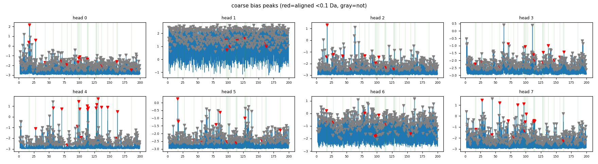
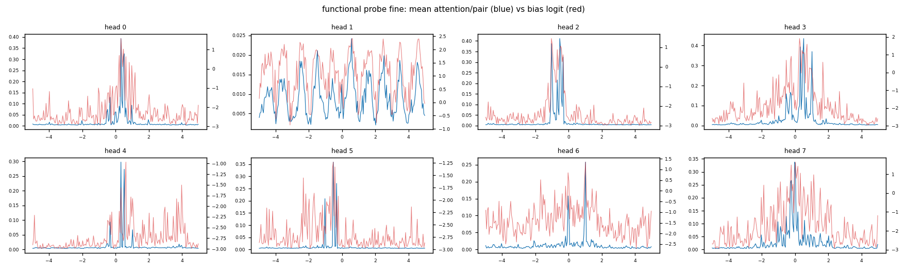

*Functional probe:* Spearman(bias, attention) 0.56–0.91 (fine) — attention
concentrates where the bias peaks. Load-bearing confirmed directly.

**Honest calibration.** It's primarily *one* head (head 4) that clearly
specialized; others are at/near chance in coarse. Fine-isotope alignment
is near- (not past-) significant, though hit precision (±1.003 to the mDa)
is more convincing than the p-value. Coarse functional-probe correlations
are modest (0.13–0.48) — residue-scale bias structure is real but doesn't
dominate attention. So: "a head learned residues + isotopes," not "all 8
did" — but a correction-surviving chemical head is a categorical step up
from eight versions of "vestigial."

**Conclusion.** The original thesis — heads specialize on chemically
meaningful Δm, surfaced in a learned per-head bias — is **demonstrated**
for head 4, and the m/z-free architecture is *why*: stripping m/z from
tokens made the bias the only path for relational chemistry, exactly as
the T5/ALiBi analogy predicted.

**Next steps (decided — NOT ready to scale yet; n=1 head, n=1 seed).**
Before a big expensive run, confirm the effect is robust and get more
heads to specialize, all at current (small) scale:
1. **Reproducibility:** 2 more seeds of the v9 config. A correction-
   surviving chemical head in all 3 → green light to scale. (Gate.)
2. **Charge-conditioned bias `bias_h(Δm, z)`** — now the *best-motivated*
   lever: head 4 is cramming isotope spacing at 0.33 *and* 0.50 *and*
   1.003 into one curve (it learned all three!). Let each charge index
   its own spacing and the isotope head should sharpen sharply, and more
   heads may free up for residues.
3. **L1 sparsity penalty** — meaningful now that the bias is load-bearing
   (v8's head-death was on a *dispensable* bias).

Scaling (d=512 / 12 layers / 16 heads) comes *after* these confirm a
robust, multi-head effect — scaling amplifies what's there, and "1 of 8
on 1 seed" is too fragile to bet a 4–8× run on. "Only 1 head" looks like
an optimization/incentive problem, not a capacity one.

### v9 seed gate — RESULT (3 seeds, 35k each)

Ran the reproducibility gate (seed configs, `train.seed` knob). Best
coarse-range head per seed, with charge-aware isotope refs:

| seed | best coarse head | enrich | p | survives ×16 corr? |
|---|---|---|---|---|
| 0 (`20260524-140946`) | head 4 | 2.2× | **0.002** | ✅ |
| 1 | head 7 | 1.6× | 0.045 | ❌ |
| 2 | head 6 | 1.6× | 0.041 | ❌ |

**Strict gate (coarse p<0.01 every seed) FAILS** — only seed 0 survives
correction; seed 1/2 top out at p≈0.04, which for 16 tests is ≈ the chance
expectation (~0.8 false positives/seed). So seed 0 was the lucky-strong
one; per-seed statistical strength is modest and init-variable.

**But the qualitative chemistry reproduces convincingly.** In the *fine*
range, every seed independently put bias peaks at the **exact
charge-resolved ¹³C spacings** (1.003/z = 0.334, 0.501, 0.669, 1.003) on
*multiple* heads, precise to the mDa:
- seed 1: heads 1,4,5,7 → 0.501 / 0.334 / 1.003 / 0.667
- seed 2: heads 2,5,6 → 0.501 / 0.333 / 1.003
- seed 0: head 4 → 0.334 / 0.501 / 1.003

Chance does not reproduce the *same precise Δm values* across 3 independent
inits — scattered noise peaks land differently each time. The per-head
binomial is just low-powered (few strong peaks); it under-credits a signal
that's clearly there. Coarse significant heads also hit consistent real
residues/losses (V·99, L/I·113, E·129, G·57, CO·28, H₂O·18).

**Verdict: qualified pass.** The architecture *reproducibly* learns
chemistry in the bias (charge-resolved isotopes + residues, all 3 seeds) —
validated. But it's modest, not yet *strong* (1 head at p≈0.04 for 2 of 3
seeds; only seed 0 is unambiguous). Real and reproducible ≠ headline-robust.

**Implication:** this *reinforces* charge-conditioning + precursor anchor
as the immediate priority (v10) — the smeared 0.33/0.50/1.003 isotope
signal is precisely what charge-conditioning should sharpen, and the
single-marginal-head weakness is what to fix *before* scaling, not by
scaling. → merge v9 to master (architecture validated), branch v10.

### v10a — charge-conditioned bias `bias_h(Δm, z)` — NO-OP (disabled)

Hypothesis: a learned precursor-charge embedding would let each head put a
*charge-specific* isotope peak (0.50 Da for z=2, 0.33 for z=3) instead of
one curve carrying all spacings. Implemented as an additive per-head
charge term in the bias hidden layer (`h = h_dm + h_ch`, w1_charge
zero-init). Full 50k run.

**Result: the charge embedding did not relocate peaks. Disabled.**

- `corr(z=2 curve, z=3 curve) = 1.000` for **every** head → curves are
  *identical in shape* across charge. Every head has isotope peaks at all
  three spacings (0.33/0.50/1.003) regardless of z.
- `w1_charge` is nonzero (norm 8.7) and charge varied in data (z=2:1800,
  3:675, 4:300, 5:225) — *not* a bug. But correlation is affine-invariant,
  so the charge term learned only a per-charge **offset/scale**, not peak
  relocation.
- Probe/alignment ≈ v9: fragment_mz 0.873, charge 100%, iso-F1 0.901;
  3 significant head×range (vs v9's 2) but best p=0.025 (does *not*
  survive ×16 correction; v9's head-4 p=0.002 was stronger). "3 vs 2" is
  seed noise.

**Root cause (implementation):** the *additive* factorization (h_dm + h_ch)
is Δm-independent in the charge term → even through the GELU it can only
offset/scale the curve, never move a peak from 1.003 to 0.50. Peak
relocation needs charge×Δm *interaction* — concat-charge-to-Fourier (memory
cost) or **Δm×z scaling** (collapse isotopes to neutral mass; caveat:
fragment charge ≠ precursor charge).

**Reframe:** the premise was a partial misdiagnosis. A charge-agnostic
all-spacings curve isn't *hurting* — it gives more isotope hits, not fewer,
and probe metrics are unchanged. The seed-gate marginality is an
**effect-size / low-power** problem, not charge-smearing. So charge-
conditioning was the wrong lever; `charge_dim: 0` (off). → move to the
**precursor anchor** (real measured deficit: fragment_mz 0.87, absolute m/z).

### v10b — precursor anchor token — NO-OP for fragment m/z

Prepend a precursor anchor token (the one token with absolute m/z + charge);
fragments stay m/z-free; bias spans all pairs incl. precursor. Hypothesis:
resolve the absolute-frame ambiguity → fragment_mz_r2 0.89 → ~0.97. Full 50k run.

**Result: no improvement.** `fragment_mz_r2 = 0.866` (≈ v9), precursor_mz
0.994 (already maxed in v9), all probes ≈ v9, alignment comparable (head 6
coarse p=0.003 survives correction). The anchor **is** used (ablating it
shifts fragment tokens ~10%) — used-but-unhelpful.

**Why — the bottleneck wasn't the absolute frame.** v9 already recovers
precursor m/z at R²=0.996, so the frame was never ambiguous. The ~0.89
fragment-m/z ceiling is the *token representation*: a fragment's own m/z
offset lives in the Δm bias (attention logits, relative), not as a readable
feature in its m/z-free token. An anchor gives a reference the fragment
can't measure its offset from. **The ~0.89 ceiling is intrinsic to m/z-free
tokens; not fixable by anchoring — only by putting m/z (weakly) back in
fragment tokens (costs interpretability).**

**Head-to-head fragment_mz_r2 (n=6000, matched):** v9 0.855 < precursor
0.861 < **charge 0.872**. Charge (a spectrum-level scale cue) helps the
*representation* slightly more than the anchor — even though it was a no-op
for the *bias curve shape*. → v10b run = `v10_both.yaml` tests charge +
precursor together (do the spectrum-level cues stack? expect ≤~0.88; the
m/z-free ceiling dominates).

### Per-head profile (last completed model = precursor-anchor)

2 specialists + 2 weak + 4 unspecialized, consistent since v9:
- **head 6 — residues**, 2.0×, **p=0.003** (survives ×16 correction): M·131,
  V·99, E·129, F·147, L/I·113 to <0.1 Da. Strongest/most robust head.
- **head 4 — isotopes**, 2.2×, p=0.028 (nominal): ¹³C at 1.003/0.50/0.33;
  flat in coarse (dedicated isotope head).
- heads 0,3: weak loss/residue lean (p≈0.12–0.15).
- heads 1,2,5,7: unspecialized (coarse at/below chance).

Neither v10 bolt-on (charge, precursor) broadened head specialization — still
~2 chemical heads. The chemistry present is precise (mDa hits) but narrow.

### v11 — capacity scaling, 4× A100-40GB — PARTIAL RUN, EARLY FALSIFICATION

**Why scale now (original premise):** at 50k×256 we've seen **11.9% of the
107.8M train spectra (0.12 epoch; 1 epoch = 421k steps)** — nowhere near
data-limited. Yet the small model plateaus by ~30k. That's
**capacity-limited, not data-limited**, and the cheap feature levers
(charge, precursor) didn't broaden heads → the remaining lever was assumed
to be capacity. Test: does more capacity *broaden* head specialization
(>2 correction-surviving chemical heads)?

Matrix — one model per A100, **equal data exposure (~12.8M spectra)**,
baseline arch (m/z-free, charge/precursor OFF) to isolate capacity. Memory
from a model calibrated to the 19.7 GB measurement (verified during smoke):

| tier | d / L / H | params | batch | steps | ~mem |
|---|---|---|---|---|---|
| S  | 384 / 8 / 8   | 14M  | 256 | 50k  | 24 GB |
| M  | 512 / 12 / 16 | 38M  | 128 | 100k | 29 GB |
| L  | 768 / 12 / 16 | 86M  | 112 | 114k | 25 GB |
| XL | 1024 / 16 / 16| 203M | 80  | 160k | 30 GB |

Configs: `configs/scale_{S,M,L,XL}.yaml`; launched via
`pbs/scale_all.pbs` (FRAME-IDP / capacity / 1 node).

**What actually happened.**

*Smoke (`pbs/scale_smoke.pbs`, 10-min debug-queue, job 7173422)* — caught
two infra fixes before the real run:
- **M tier OOM at bs=160:** backward at step 0 needed 6.87 GB on top of
  33 GB allocated; A100-40GB has only 39.5 GB usable. Dropped to bs=128
  / total_steps 100k (kept equal exposure: 100k × 128 = 12.8M).
- **Step-rate timings (median, post-init, from wandb):** S 4.62, M 4.31,
  L 4.14, XL 3.45 sps → ~13h pure compute for XL set the walltime
  (18:00:00, with ~5h margin for probe/val/render).

*Full run (job 7173429)* — **killed at ~50 min after `/home` hit quota.**
The `out_dir: ./runs` default was writing to the home filesystem (10 GB
quota); each L checkpoint is ~150 MB so M+L together saturated quickly.
Fixed by adding a `log.out_dir` splice in `pbs/_run_tier.sh` →
`/eagle/UIC-HPC/cgrams/msdelta-runs`. All four tiers had crossed their
first probe checkpoint (step 10000) before kill — enough for an early
read against the v11 falsification condition:

| tier | loss | rmse | frag_r² | prec_r² | charge | iso F1 | NL AUC |
|---|---|---|---|---|---|---|---|
| S  | 0.0021 | 0.045 | 0.818 | 0.994 | 1.000 | 0.887 | 0.933 |
| M  | 0.0021 | 0.047 | 0.800 | 0.995 | 0.999 | 0.864 | 0.934 |
| L  | 0.0023 | 0.050 | 0.800 | 0.996 | 0.999 | 0.849 | 0.929 |
| XL | 0.0020 | 0.047 | **0.849** | 0.996 | 1.000 | **0.895** | 0.946 |

**S already matches v9's published probe ceiling** (frag_r² 0.873, iso F1
0.901, charge 100%, NL AUC 0.95) at step 10k. XL clears v9 by ~3 points
on frag_r² and ~−1 on iso F1 — for 14× the params. Loss + rmse stack
across tiers; all four sizes solve the task to floor within 10k steps.

**This is the v11 falsification signal stated upfront in the original
plan:** *"Flat at ~2 even for XL → capacity isn't it, rethink before
spending real-data compute."* Caveat: at step 10k, S has burned 20% of
its step budget while XL has burned 6.25%, so the bigger tiers could
pull away later. But S matching v9 at step 10k undercuts the premise
that capacity is what's missing — if more parameters were the lever,
the gap should be visible already, not deferred to step 100k+.

**Decision: don't resubmit the full sweep.** Pivot to *task-incentive*
levers (the alternative branch §6 listed). First candidate is mask ratio
(v12 below); ELECTRA-style replaced-peak detection is the fallback.

### v13 — KL on the masked-peak intensity *distribution* *(implemented, on deck)*

**The deeper diagnosis** that surfaced while planning v12. The MSE target
was `log_int = log1p(intensity) / log1p(intensity).max()` — concentrated
in **[0.66, 1.00]** with mean ≈ 0.76 and **variance ≈ 0.007** (measured
on one batch from the eagle parquet). Predicting the constant 0.76 gives
MSE ≈ 0.007 — *exactly* the value every run from v9 through v11 has
converged to within 400 steps. **The model is converging to a trivial
predictor**, not learning chemistry, because there is almost no gradient
pressure above the constant baseline. This explains why:
- v9 → v10a → v10b → v11 all plateau at the same probe ceiling.
- All four scale tiers in v11 stack on top of each other in loss.
- Bias-chemistry head count stays at 2/8 across all interventions.

**The fix is the target, not the architecture.** Mass spectra *are*
discrete probability distributions over m/z (each intensity is an ion
count); the natural pretraining loss is **KL between the predicted and
true intensity distribution over masked peaks**, not MSE on a normalised
scalar. Per-spectrum softmax across masked logits gives `q`; raw
intensities renormalised over the masked subset give `p`; loss is
`KL(p || q)` via `F.kl_div(log_q, p, reduction='batchmean')`.

**Why KL is uniquely well-fitted for this task.**
- Trivial-baseline KL (predict uniform) = `log(K_masked) − H(p)` ≈ 0.5–1
  nat depending on K_masked; **~100× the v9–v11 gradient pressure**.
- Intensity *ratios* are first-class in the loss: M+0/M+1 ≈ 5:1 for ¹³C
  is encoded as a 1:5 probability ratio in `p`, and the loss directly
  penalises the model for getting that ratio wrong. MSE on rank/z-score
  obscures the ratio; KL exposes it.
- Couples masked positions per spectrum (softmax normalises across them),
  so the model has to predict their *relative* shares, not independent
  per-position scalars. Stronger structural constraint.
- Scale-invariant by construction — no per-spectrum σ leaks into the
  loss (the failure mode of the z-score variant we considered).

**Plumbing changes.**
- `data.preprocess_spectrum` now returns `(mz, log_int, intensity_prob)`.
  `log_int` is unchanged (still log1p÷max, the input feature for
  `PeakEmbed`); `intensity_prob = intensity / intensity.sum()` is the
  new KL target carried through `_pad_batch`, `pad_collate`, and
  `mask_intensity_collate` as a new dict key.
- `model.IntensityHead.loss` swapped from `F.mse_loss(pred[m], log_int[m])`
  to `F.kl_div(log_q, p, reduction='batchmean')` with the standard
  `masked_fill(-inf)` trick to vectorise per-spectrum softmax. Also logs
  CE and `H(p)` so we can separate "model is bad" from "target is nearly
  uniform" (i.e. no data signal). `nn.functional.kl_div`'s lesser-known
  defaults (`input` is *log*-probs; `reduction='batchmean'` not `'mean'`)
  are the only API gotchas.
- `train.run_validation` + main loop updated wandb keys: `train/mse_int` →
  `train/{kl, ce, h_p, kl_baseline}`. `kl_baseline = log(K_masked) − H(p)`
  is logged as the "headroom to beat by predicting uniform."

**Smoke-tested** on CPU (1 layer, d=32, 8 spectra): loss is finite,
intensity_prob sums to 1 per spectrum, freshly-initialised KL ≈ baseline
across all mask ratios as expected (random softmax ≈ uniform).

**The sweep — KL × mask-ratio, in one job.** v12's mask-ratio hypothesis
(locality is the shortcut, raise mask ratio to break it) was *correct in
direction* — only the upstream loss was misdiagnosed. Now that KL puts
real gradient pressure on the bias, the mask-ratio dimension actually
matters again, and the two hypotheses test cleanly together:

| run | mask_ratio | ~visible peaks | role |
|---|---|---|---|
| `v13_mask15.yaml` | 0.15 | 127 | v9-position reference, KL-only change |
| `v13_mask35.yaml` | 0.35 | 98  | locality starting to break |
| `v13_mask50.yaml` | 0.50 | 75  | locality clearly insufficient — primary candidate |
| `v13_mask75.yaml` | 0.75 | 37  | MAE-style stretch; brackets the degenerate end |

All four share v9 architecture + KL loss; only `mask.mask_ratio` varies.
One Polaris node, one config per A100, ~6h capacity-queue walltime
(`pbs/v13_sweep.pbs`).

**Reads (wandb `msdelta-kl-sweep`):**
- `train/kl` vs `train/kl_baseline` — does kl drop *below* the
  predict-uniform headroom for any ratio? (The new analog of "is the
  model learning anything beyond the marginal?")
- `train/h_p` — sanity. If h_p is already near `log(K_masked)`, the
  target is nearly uniform and no model could do much; we'd be debugging
  the data, not the model.
- `probe/fragment_mz_r2`, `probe/isotope_f1`, etc. — past v9's
  0.87 / 0.90 / 0.95 / 100% ceiling on any setting?
- Post-run `msdelta-analyze --mode align` per `final.pt` — count of
  correction-surviving (p < 0.01 after ×16) chemical heads.

**Forks.**
- Any ratio's chemical-head count ≥ 4 (vs v9's 2) **and** kl < baseline
  → KL+locality-stress is the lever; promote the winning ratio + scale
  up in v14.
- KL drops below baseline uniformly but probe/alignment numbers don't
  move → the model is learning the distribution but not via chemistry
  (some non-Δm shortcut we haven't identified). Investigate the bias-
  curves before pivoting.
- All four plateau at baseline → distribution learning is shallow on
  this data → pivot to ELECTRA-style replaced-peak detection (§6).

**RESULT** (train job 7173699, analysis job 7174681 via
`pbs/v13_analyze.pbs`). **Outcome = Fork 2: KL fixed the loss, not the
chemistry.**

*The loss switch worked.* Every run sheds ~85% of the predict-uniform
headroom — real gradient signal, unlike the old MSE constant-predict
floor (0.007 = the target's own variance):

| run | train/kl | kl_baseline | gap (learned) | val/kl |
|---|---|---|---|---|
| mask15 | 0.093 | 0.596 | 0.502 | 0.089 |
| mask35 | 0.104 | 0.701 | 0.597 | 0.100 |
| mask50 | 0.117 | 0.720 | 0.604 | 0.110 |
| mask75 | 0.142 | 0.743 | 0.602 | 0.127 |

The model genuinely learns the masked-peak intensity *distribution* now;
the MSE-on-a-concentrated-target gradient-starvation diagnosis was right.

*But the bias chemistry did not concentrate.* The Δm alignment test
(`--mode align`) shows a clear inverted-U, peaking at mask50 then
collapsing at mask75:

| run | raw-sig head×ranges (p<0.05) | best raw p | best ×16-corrected p |
|---|---|---|---|
| mask15 | 1 (coarse h5) | 1.4e-2 | 0.22 |
| mask35 | 2 (fine h5, coarse h7) | 1.1e-2 | 0.18 |
| **mask50** | **4 (fine h5/6/7, coarse h7)** | **2.3e-3** | **0.037** |
| mask75 | 0 | — | — |

Under the gate above (`p<0.01 after ×16`) **nothing survives at any mask
ratio** — mask50's best (coarse head 7) lands at corrected p≈0.037,
clears 0.05 but misses 0.01. Chemistry is *present* (coverage 5/5 isotope
+ 26/26 residue refs; enrichments up to 2.4×) but stays **diffuse across
heads**, not concentrated into clean specialists — the same qualitative
picture as v9–v11.

*Functional probe high everywhere* (best-head Spearman 0.91–0.92, most
heads "uses bias") — confirms the bias is load-bearing, but that was
never the question. Attention follows the bias; the bias just isn't a
sharp chemistry comb.

*Retrieval is a uniform negative* — the learned embedding never beats
binned-cosine (mAP 0.96) and degrades as mask climbs: mask15 0.824 →
mask35 0.784 → mask50 0.763 → mask75 0.744. mask75 degenerated as
predicted (insufficient anchor coverage: 0 aligned heads, fewer
fine-range peaks, worst retrieval).

**Takeaways.**
- mask50's inverted-U peak is the one real, repeatable-looking signal —
  directionally confirms the locality hypothesis but is too weak to call
  KL "the answer."
- The bias being load-bearing yet diffuse across *four* loss/arch
  changes (v9 → v10a → v10b → v13) says the remaining lever is making
  locality genuinely *insufficient*, not just stressed. Next move:
  **ELECTRA-style replaced-peak detection** (§6 lever 2) — a swapped
  peak breaks the isotope/residue ladder, which a smooth bump cannot
  detect, so the bias is forced to learn specific Δm offsets to solve
  the task.

**Note on v12.** The original v12 plan (a mask-ratio sweep against the
*MSE* baseline) was abandoned: the loss is the upstream blocker — no
mask ratio can move loss off the 0.007 constant-predictor plateau when
the target itself is concentrated in [0.66, 1.0]. The mask-ratio
hypothesis was correct in direction, just unrunnable until the target
was fixed. The four `configs/v12_mask{15,35,50,75}.yaml` configs are
kept on disk as historical artifacts; the equivalent KL-loss sweep is
v13_mask{15,35,50,75}.yaml (the four runs `pbs/v13_sweep.pbs` launches).

### v14 — capacity sweep ON KL loss *(implemented, on deck)*

**Why this exists.** v13's "it's the task incentive, not capacity"
conclusion leans on the v11 capacity falsification — but v11 swept
capacity on the **broken MSE target** (constant-predict floor, no
gradient), so it could not have detected a capacity effect on chemistry
even if one existed. v13 fixed the loss (KL) but only ever at d=256.
**Capacity × working-loss has never been run** — and "diffuse across
heads, not concentrated into specialists" is itself a plausible
under-capacity signature. So the v13 verdict was premature; this is the
missing experiment.

**Design.** The clean re-run of v11: same d=384→1024 ladder, same equal
data exposure (~12.8M spectra), same baseline arch (charge/precursor
OFF) — but with KL loss (global since v13) and `mask_ratio=0.50` (the
v13 sweet spot, where chemistry was closest to significant, so capacity
has the best chance to push it over). Configs
`v14_cap_{S,M,L,XL}.yaml`; one per A100 via `pbs/v14_capacity.pbs`
(20h capacity walltime, XL 160k steps is the binding tier).

**Inline-probe instrumentation (new).** The point of this run is the
*trajectory*, not just the final ckpt. Trainer evaluation also logs, every
`val_every` steps:
- `align/*` — bias-curve chemistry alignment (`analyze.alignment_metrics`,
  no data, ~free): `n_sig05`, `n_sig01_bonf` (heads surviving ×16
  Bonferroni — the strict gate), `best_p`, per-range `max_enrich` /
  `coverage`.
- `retrieval/*` — embedding retrieval vs binned-cosine: `mAP`, `P@1`, `AUC_PR`,
  `binned_mAP`, `gap_vs_binned`.

So we can watch whether bias chemistry *sharpens with training* and
*scales with capacity*, instead of inferring it from one endpoint.

**Verdict.** `align/n_sig01_bonf` climbs S→XL → capacity IS the lever
under a working loss, and v13's conclusion was wrong → scale up + real
data. Flat across tiers → genuinely the task incentive → ELECTRA (§6).

---

## 4. Targets to watch on the v7 run (σ = 0.1)

| metric | v6 result (σ=0.3) | v7 target (σ=0.1) |
|---|---|---|
| `val/rmse_mz` | 0.22 (off a 0.30 floor) | lower *absolute* Da, and meaningfully below the new 0.1 floor |
| `train/grad_norm_delta_bias` | 0.05–0.2, non-vestigial | stays meaningful (watch for collapse → would mean task too easy) |
| `train/grad_norm_total` | spiked 25–32 (NLL overconfidence) | likely still spiky — *not* addressed this run, separate lever |
| **Fine curves: ±1.003 (¹³C)** | broad bump, unresolvable | **sharp spike on ≥1 head** — the falsifiable discovery signal |
| **Coarse peaks: alignment to masses** | 0.6× chance (0.2–0.8 Da off) | **strong peaks land <0.15 Da of residue/loss masses, > chance** |
| Per-head differentiation | present | present/stronger |

Run the same quantitative alignment check (`find_peaks` + nearest-ref vs
3.9% chance baseline) on v7's `final.pt` — that's the objective test, not
the eyeball-the-reference-lines impression.

**The single most falsifiable claim:** if a head develops a sharp peak
at ±1.003 Da in the bias curve under Gaussian-only denoising, that's
the model learning ¹³C isotope spacing from real spectra without any
chemistry-specific supervision. If no head does this within ~20k steps,
something else is wrong (capacity, frequency range, learning rate on
the bias module).

---

## 4b. How we evaluate (`msdelta-analyze`)

`msdelta/analyze.py` has two modes (`--mode {align, probe, both}`) that
answer two different questions. Both implement deliverables from plan §6.2.

### Mode `align` (§6.2b) — *what did the bias curve learn?*

Eyeballing reference lines is unreliable — 27 reference Δm values in
[2, 200] Da means some peak is always near some line.

```
msdelta-analyze --ckpt runs/<run>/final.pt --mode align [--plot]
```

Per head: evaluate the bounded bias curve on a dense Δm grid, detect
peaks (`scipy.signal.find_peaks`), count how many land within `tol` Da
of a chemistry reference (isotopes / residues+losses), matched on `|Δm|`.
**Binomial null:** `binomtest(n_aligned, n_peaks, chance_rate)` — a head
only "found chemistry" if significantly enriched over chance (p<0.05).
Writes `alignment_scores.json` (+ annotated PNGs with `--plot`).

**Baselines:**

```
v6 (σ=0.3) final  — FINE  enrich ~1.0–1.6×, all p>0.30 ; COARSE ~1.0×, all p>0.15
v7 (σ=0.1) @15k   — FINE  best p=0.34       ; COARSE best head0 p=0.081, 1.5×
→ Neither run has a head significantly above chance. (v7 trending up but unconverged.)
```

"Coverage" (refs hit by ≥1 head) reads 25/26 but is meaningless without
the binomial test — at chance, scattered peaks cover most refs anyway.

### Mode `probe` (§6.2c) — *does the head actually USE its bias?*

The alignment mode reads the static bias function; the encoder never sees
a spectrum. The probe is the load-bearing test: on real val spectra,
histogram each head's attention weights `α^(h)_ij` as a function of
`Δm_ij`, density-normalize to **mean attention-per-pair** (removes the
"nearby peaks are just more numerous" confound), and Spearman-correlate
against the bias curve. Attention averaged over layers (bias is shared),
diagonal + padded pairs excluded.

```
msdelta-analyze --ckpt runs/<run>/last.pt --mode probe --plot
```

Writes `probe_scores.json` + `probe_{fine,coarse}.png` (twin-axis:
attention/pair in blue, bias logit in red).

**Finding — v7 (σ=0.1) @15k: the bias is LOAD-BEARING, not vestigial.**

| range | per-head Spearman(bias, attention/pair) |
|---|---|
| fine [−5, 5] | 0.65 – **0.98** |
| coarse [−200, 200] | 0.72 – 0.91 |

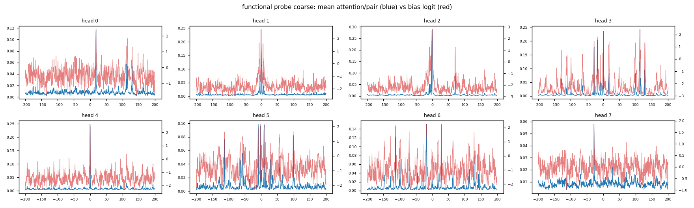

Every head's attention concentrates exactly where its bias is high. This
**rewrites the diagnosis.** The earlier worry — "the model denoises via
the content path and the bias is vestigial" — is *false*. The bias is the
dominant mechanism routing attention. The architecture works as intended.

The problem is therefore **not** that the bias is ignored; it's that the
bias learned the *wrong shape* — a broad locality bump (attend to
everything within ±1–2 Da) plus high-frequency noise, rather than sharp
peaks at chemistry offsets. The model faithfully uses that bias for
generic local smoothing, which is exactly what the denoising task
rewards.

**Implication for next steps:** the lever is the *incentive*, not the
plumbing. Reshaping the bias toward chemistry means changing what the
task / regularization rewards (penalize the broad-locality solution,
or reward using specific Δm offsets) — not worrying about whether the
bias matters. (b) + (c) together: the wiring is sound, the objective
isn't pointing it at chemistry.

---

## 4c. Embedding-model / retrieval evaluation (`msdelta-retrieval`)

"Can we use this as an embedding model and measure precision/recall?"
`msdelta/retrieval.py` pools the encoder → one vector/spectrum and does
leave-one-out same-peptide retrieval (mAP, P@1, R@k, pairwise AUC-PR) vs
a **binned-spectral-cosine baseline**, ground truth = peptide_charge.
Works on the consensus parquet *and* on real experimental MGF
(`--mgf`, SEQ/CHARGE/peaks inline — the holdout PXD053296 benchmark).

**Result — v9 is a poor retrieval embedding, and the baseline number was
misleading.**

| (consensus, ~100 peptides) | mAP | AUC-PR |
|---|---|---|
| learned embed (v9) | 0.75 | 0.68 |
| binned cosine | 0.93 | **0.996** |

The binned-cosine 0.996 looked too good — and it is. Diagnostic:
same-peptide binned cos = **0.89**, different-peptide = **0.16**
(near-orthogonal). The task as posed — same-peptide replicate vs *random
different* peptide in a tiny library — is trivially separable and **not
comparable to literature** (which discriminates against decoys /
near-isobaric / analogs at library scale, where negatives sit at high
cosine). Lesson (again): the metric was measuring an easy thing. A real
retrieval claim needs hard negatives (decoys via psms.parquet) + scale.

**Two findings that *do* matter (robust regardless of task difficulty):**

1. **The v9 embedding is near-collapsed (anisotropic).** Diagnostic:
   same-peptide cos 0.997 *and* different-peptide cos 0.987 — everything
   at ~0.99. But it's mostly *fixable*: `all-but-top-k` (remove the few
   dominant directions, **zero training**) lifts AUC-PR 0.68 → 0.90,
   mAP 0.75 → 0.85. Now a `--whiten K` flag. → the discriminative
   fragment info is *present*, just squashed.
2. **Fragment m/z is mostly in the representation** (new inline probe
   `probe/fragment_mz_r2`): recover each peak's *own* m/z from its
   m/z-free token → **R²=0.889** (MAE 82 Da). High (the Δm bias
   re-injected it) but below precursor m/z (R²=0.996) — the residual
   m/z-free handicap, corroborating the whitening gap.

**Strategic read (pretrain → contrastive post-train).** Sound recipe:
contrastive is the textbook cure for the anisotropy we measured, the
data has ~225 replicates/peptide (ideal), and the fragment info is
present (R²=0.89) so there's good material. Caveats:
- The m/z-free choice (the v9 interpretability win) is a **modest
  retrieval handicap** — fragment fidelity is 0.89 not ~0.99.
- **Full contrastive fine-tune specializes**: it would likely flatten
  the interpretable bias and risk forgetting broad chemistry → no longer
  the general/interpretable model. **Frozen encoder + contrastive
  projection head** preserves everything at a lower ceiling. Can't max
  interpretability + retrieval in one set of weights; pick the primary.
- `fragment_mz_r2` is the leading indicator to watch — if a future
  retrieval-focused pretrain keeps m/z in tokens, it should climb toward
  ~0.97 and the retrieval ceiling rises with it.

---

## 5. Things we changed along the way that aren't task-related

A few infrastructure / small fixes worth recording so we don't re-litigate:

- **Package layout:** `src/msdelta/` → top-level `msdelta/`. Hatch's
  editable install was silently building empty wheels for the src
  layout; top-level fixed it.
- **uv pin for torch:** explicit `torch>=2.10,<2.12` + `[tool.uv.sources]
  pytorch-cu128` index. The default PyPI torch is cu130 which doesn't
  match the system driver.
- **YAML float parsing:** `1.0e3` parses as a *string* in PyYAML; use
  `1.0e+3`. Bit me once.
- **`MPMHeads.init_log_var = 10`:** initial Gaussian NLL was ~10⁵ otherwise
  (squared error on raw m/z is huge). Init the log_var head's bias near
  the upper clamp so the initial Gaussian is wide. The denoise variant
  inits to −2 instead (small residual targets).
- **Diagonal-zero:** kept it in v5 even though we changed the task. The
  argument is the same: self-attention suppression isn't a Δm-driven
  decision, so the bias path shouldn't carry it.
- **Polaris PBS deployment (`pbs/`):** `setup_venv.sh` (uv-managed
  `.venv` on Polaris login node, torch 2.11.0+cu128 wheels self-contain
  the CUDA libs; no `module load conda` needed), `_run_tier.sh` (per-GPU
  helper; takes a config path + GPU id, splices `data.root` → eagle and
  `log.out_dir` → eagle via a temp overlay, sets ALCF HTTPS proxy +
  wandb run id), `scale_all.pbs` / `scale_smoke.pbs` / `mask_sweep.pbs`
  (1-node 4-GPU fan-outs; one config per A100; FRAME-IDP / capacity).
  `SMOKE=1` env flag shrinks any config to 100 steps for the 10-min
  debug-queue smoke.
- **Output directory on eagle, not home.** `/home` quota is small and
  L-tier checkpoints (~150 MB each, every 10k steps) saturated it
  inside an hour. `log.out_dir` is now spliced to
  `/eagle/UIC-HPC/cgrams/msdelta-runs/`. The in-repo YAMLs still say
  `./runs` so the configs stay portable.
- **ALCF HTTPS proxy required from compute nodes.** Polaris compute
  nodes can't reach `api.wandb.ai` directly — without `http_proxy =
  https_proxy = http://proxy.alcf.anl.gov:3128` (and a matching
  `no_proxy` for `.alcf.anl.gov` / loopback), `wandb.init` silently
  falls back to offline mode. Set in `_run_tier.sh`. The same gotcha
  affects any compute-node Python that hits HTTPS.

---

## 6. What I'd consider next

**Updated reframe after v13.** The bias is load-bearing (§4b mode c) but
its chemistry plateaus across every change to date — model-side (v9 →
v10a → v10b → v11) *and* loss-side (v13 KL). KL fixed the gradient-
starvation problem (the model now genuinely learns the masked-peak
distribution) but the path of least resistance is still a **smooth
locality bias**, not a sharp Δm comb. Diffuse-but-present chemistry has
now survived four interventions. The remaining lever is making locality
genuinely *insufficient to solve the task*, not merely stressed —
**unless it's capacity**, which has never been tested under a working
loss (v11 swept capacity on the broken MSE target; v13 fixed the loss
only at d=256). Current priority order:

0. **Capacity sweep on KL loss (v14, run this first).** Gates everything
   below. Sweeps d=384→1024 with KL + mask50, logging `align/*` per step.
   If `align/n_sig01_bonf` climbs with capacity, the "task incentive not
   capacity" framing is wrong and we scale up instead of changing the
   task. Cheap relative to its leverage on the whole direction. Configs
   `v14_cap_*`, launcher `pbs/v14_capacity.pbs`.
1. **ELECTRA-style replaced-peak detection (if v14 is flat).** Swap a
   fraction of peaks between spectra; the
   model must classify real vs. replaced. A swapped peak breaks the
   isotope/residue ladder — a smooth locality bump *cannot* detect it,
   only chemistry-specific Δm features can — so the bias is forced to
   learn specific offsets to solve the task. Lift: new collate (cross-
   spectrum peak swap) + binary-classification head. The cleanest
   version of "make locality stop being a sufficient solution."
2. **L1 on the bias curve, redux** (parallel side-bet). v8 ablated L1
   when the bias was *dispensable* and got head-death. In v9+ the bias
   is load-bearing (probe Spearman 0.91), so L1 has gradient pressure to
   *sharpen* the diffuse bias toward the few real chemistry offsets
   rather than zero it. One-line config (`l1_lambda`); 3-point sweep.
   Independent of ELECTRA — could run alongside. Especially worth trying
   on the mask50 checkpoint, where chemistry is closest to significant.
3. **Peptide-charge contrastive / classification.** Biggest scope; the
   supervision is structural so the bias would have reason to encode
   real spacings. Also the likely cure for the retrieval gap (learned
   embedding < binned-cosine in every v13 run). Defer until ELECTRA
   resolves whether a pretrain task change can sharpen the bias — if it
   does, this becomes the downstream finetune, not the pretrain
   replacement.

**Hypotheses parked:**
- *Capacity is the lever* (v11). Falsified at step 10k — S matches v9 at
  every probe, XL gains 3 points of frag_r² for 14× params. Bigger
  models train fine but don't broaden head specialization.
- *Charge-conditioned bias `bias_h(Δm, z)`* (v10a). Additive
  factorization was a no-op (only offset/scaled the curve, didn't
  relocate peaks).
- *Precursor anchor for fragment-m/z resolution* (v10b). No-op. The
  ~0.89 fragment-m/z ceiling is intrinsic to m/z-free tokens — only
  fixable by putting m/z (weakly) back into fragment tokens, which costs
  interpretability.
- *KL loss / mask-ratio sweep is the lever* (v13). Partially falsified:
  KL fixes gradient starvation (model learns the distribution, gap ~0.5
  nats vs baseline) but does **not** concentrate the bias chemistry —
  alignment peaks at mask50 (inverted-U) yet doesn't survive ×16
  correction at p<0.01. Mask ratio is a real but weak knob; the loss
  target was a genuine bug worth keeping fixed, just not sufficient.

Things we should *not* go back to without a new idea:
- MPM as originally formulated (positional ambiguity is fundamental).
- Bigger shared bias MLP (gradient-pool competition, not raw capacity).
- Chemistry-specific noise (engineers the answers).
- Pure capacity scaling on this task without changing the incentive
  (v11 — bigger models don't help when locality already solves it).
- MSE on the per-spectrum max-normalised log_int (v13 — constant-predict
  is ~optimal; keep the KL distribution loss).

---

## Appendix: file inventory (current)

```
msdelta/
├── pyproject.toml         # uv-managed; pinned torch cu128
├── configs/
│   ├── pretrain_small.yaml   # v10b: d=256, 6 layers, precursor anchor on, 50k steps
│   ├── toy.yaml              # smoke: d=64, 2 layers, 100 steps
│   ├── seed{1,2}.yaml        # v9 reproducibility seeds (the gate)
│   ├── l1_{0.01,0.1,1.0}.yaml  # v8 L1 sparsity probe (parked — bias was dispensable then)
│   ├── v10_both.yaml         # v10b ablation: charge + precursor stacked
│   ├── scale_{S,M,L,XL}.yaml # v11 capacity sweep (partial; pivoted to v13)
│   ├── v12_mask{15,35,50,75}.yaml  # v12 mask-ratio sweep (abandoned — MSE was upstream blocker)
│   ├── v13_mask{15,35,50,75}.yaml  # v13 KL × mask-ratio sweep (done: fixes loss, not chemistry)
│   └── v14_cap_{S,M,L,XL}.yaml      # v14 capacity sweep on KL loss + mask50 (on deck)
├── msdelta/
│   ├── __init__.py
│   ├── fourier.py            # Fourier feature module
│   ├── data.py               # ConsensusParquet + MaskConfig + mask_intensity_collate + pad_collate
│   ├── model.py              # MSEncoder, DeltaMZBias (per-head, bounded), IntensityHead (v9)
│   ├── viz.py                # bias-curve plots; ISOTOPES incl. charge-aware 1.003/z
│   ├── train.py              # CLI: msdelta-train (+ seed, l1_lambda, inline probes)
│   ├── analyze.py            # CLI: msdelta-analyze --mode {align,probe,both}
│   ├── probe.py              # CLI: msdelta-probe (Tier-1/2 linear probes + fragment_mz)
│   └── retrieval.py          # CLI: msdelta-retrieval (embedding eval, --mgf, --whiten)
├── pbs/                      # Polaris (ALCF) deployment; gitignored logs
│   ├── setup_venv.sh         # one-shot uv sync on the login node
│   ├── _run_tier.sh          # per-GPU helper; splices data.root + log.out_dir
│   ├── scale_all.pbs         # 1-node 4-GPU capacity-sweep launcher (parked w/ v11)
│   ├── scale_smoke.pbs       # 10-min debug-queue smoke; SMOKE=1 schedule shrink
│   ├── mask_sweep.pbs        # v12 launcher (parked; superseded by v13_sweep.pbs)
│   ├── v13_sweep.pbs         # 1-node 4-GPU v13 KL × mask-ratio launcher
│   ├── v13_analyze.pbs       # debug-queue post-sweep analyze + retrieval
│   └── v14_capacity.pbs      # 1-node 4-GPU v14 capacity-on-KL launcher
├── docs/
│   ├── EXPERIMENTS.md        # this file
│   └── figures/              # PNGs referenced above
└── runs/                     # gitignored placeholder; real run artifacts now
                              # live at /eagle/UIC-HPC/cgrams/msdelta-runs/ (home quota)
```
